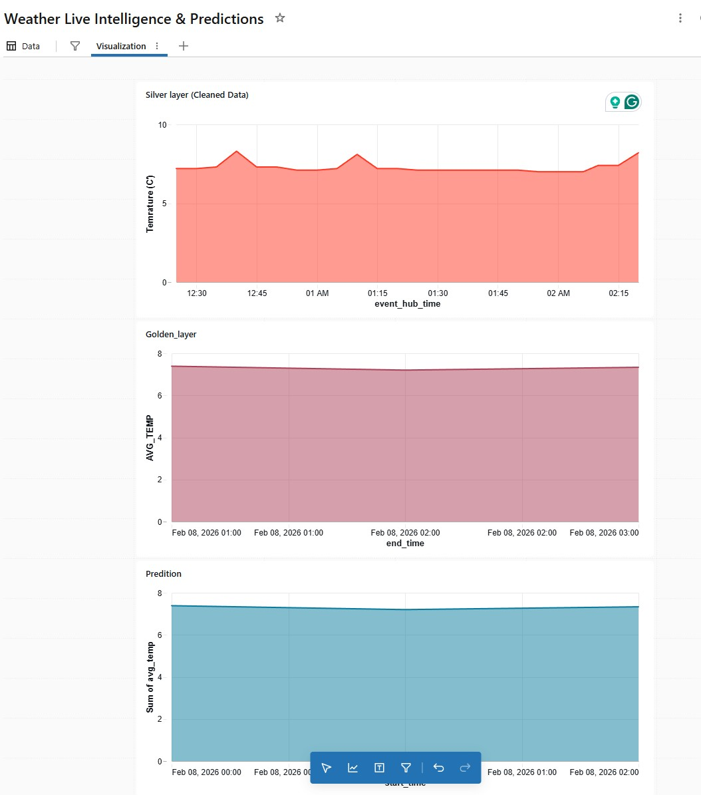
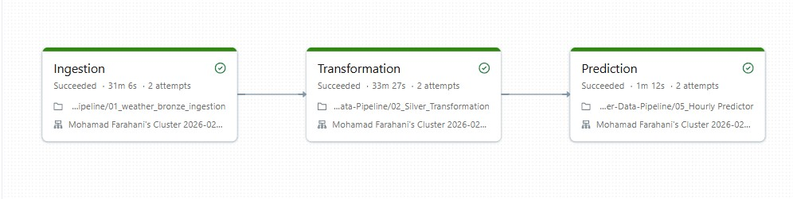

# 🌦️ Real-Time Weather Intelligence & ML Forecasting Pipeline

An end-to-end Data Engineering and Machine Learning project built on the **Azure Databricks Lakehouse**. This project ingests live weather data via **Azure Event Hubs**, processes it through a **Medallion Architecture**, and applies **Linear Regression** to predict future temperatures.

---

## 🚀 Project Overview
This pipeline is designed to handle high-velocity streaming data, ensuring that raw weather information is cleaned, structured, and utilized for predictive analytics within minutes of capture.

### **Key Features**
* **Real-Time Ingestion**: Leverages **Spark Structured Streaming** to pull live JSON payloads from Azure Event Hubs.
* **Medallion Architecture**: Data is organized into **Bronze** (Raw), **Silver** (Cleaned), and **Gold** (Aggregated) Delta tables for high reliability and performance.
* **Automated ML Training**: A **Linear Regression** model is retrained hourly using **Spark MLlib** to adapt to shifting weather patterns.
* **Production-Grade Security**: Credentials and connection strings are managed via **Databricks Secret Scopes** and **Azure Key Vault**.
* **Automated Orchestration**: The entire lifecycle is managed by a **Databricks Workflow (DAG)** that triggers ingestion, transformation, and prediction tasks.

---

## 🛠️ Tech Stack
* **Language:** PySpark (Python)
* **Cloud:** Azure (Event Hubs, Key Vault)
* **Platform:** Databricks (Lakehouse, Workflows, AI/BI Dashboards)
* **Storage:** Delta Lake (ACID Transactions, Time Travel)
* **ML Framework:** Spark MLlib (Linear Regression)

---

## 📐 Data Architecture (Medallion)
The data follows a structured flow through three distinct layers:

1.  **Bronze (Raw Layer):** Stores the raw JSON responses from the WeatherAPI exactly as they arrive from Event Hubs.
2.  **Silver (Cleaned Layer):** Parses the JSON, enforces schema, handles timestamp conversions, and filters data for downstream use.
3.  **Gold (Analytics & ML Layer):** * **Summary Table:** Aggregated metrics (Average Temp/Humidity) for business intelligence.
    * **Prediction History:** Stores the outputs of the ML model (Actual vs. Predicted) to track model performance.

---

## 🤖 Machine Learning Implementation
To forecast the "Next Hour" temperature, the project utilizes a **Linear Regression** model.
* **Feature Engineering:** Extracts Unix Timestamps, Hour of the Day, and Day of the Year to capture cyclical patterns.
* **Feedback Loop:** The model is retrained every hour by the Databricks Workflow to incorporate the most recent data points, minimizing prediction error (RMSE).

---

## 🛡️ Security & DevOps
* **Secrets Management:** No hard-coded keys. All connection strings are retrieved dynamically using `dbutils.secrets.get()`.
* **Git Integration:** Project managed via Databricks Git Folders for seamless version control with GitHub.
* **Orchestration:** A multi-task **Databricks Job** ensures sequential execution of the data pipeline and ML retraining.

---

## 📈 Dashboard & Visualization
The project features a **Databricks AI/BI (Lakeview) Dashboard** that provides:
* **Live Thermometer:** Current weather status for selected cities.
* **Forecast Accuracy:** A dual-line chart overlaying the **Silver Layer (Actual)** data with the **ML Gold Layer (Predicted)** data.
* **Historical Trends:** Interactive filters to explore weather patterns over time.

---

## 📝 Setup Instructions
1.  **Infrastructure:** Set up an Azure Event Hub Namespace and a WeatherAPI.com developer account.
2.  **Security:** Create an Azure Key Vault and link it to a Databricks Secret Scope named `weather-scope`.
3.  **Notebooks:** Import the notebooks into your Databricks Workspace.
4.  **Workflow:** Create a new Job in **Jobs & Pipelines** and link the notebooks in the following order: `Ingestion` -> `Transformation` -> `Prediction`.
5.  **Schedule:** Set the trigger to run every 1 hour for optimal ML retraining.

---
